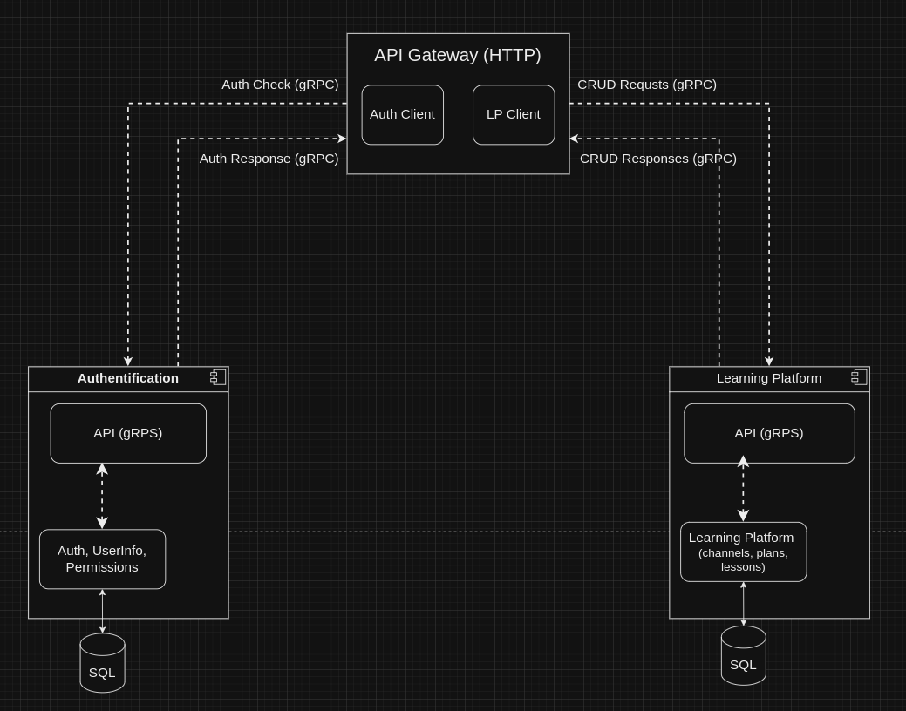

**First of all clone this repo and anather one** (https://github.com/DimTur/lp_auth and https://github.com/DimTur/lp_learning_platform)

This is 3 service. How To star them, you can see in readme.md of each one and how they comunicate you can see on the diagrams down below.

**To start this service (lp_api_gateway) you need to use next command:**

    go run cmd/main.go serve --config=./config/local.yaml

After it you can use api in address: http://localhost:8000/swagger/index.html

**How to start jaegger. I use 1.60v.** Maybe this is quite a lot, but it's for testing purpose

https://www.jaegertracing.io/docs/1.61/getting-started/#sample-app-hotrod

    docker run --rm --name jaeger \
        -e COLLECTOR_ZIPKIN_HOST_PORT=:9411 \
        -p 6831:6831/udp \
        -p 6832:6832/udp \
        -p 5778:5778 \
        -p 16686:16686 \
        -p 4317:4317 \
        -p 4318:4318 \
        -p 14250:14250 \
        -p 14268:14268 \
        -p 14269:14269 \
        -p 9411:9411 \
        jaegertracing/all-in-one:1.60

And go to http://localhost:16686

**Prometheus**

1. If you want to see prometheus GUI you need to do several commands:
    
        ip addr show docker0

    You can see somthing like that:

        ubuntu@ubuntu:~/Desktop/projects/lp_api_gateway$ ip addr show docker0
        5: docker0: <NO-CARRIER,BROADCAST,MULTICAST,UP> mtu 1500 qdisc noqueue state DOWN group default 
            link/ether 02:42:14:0d:7f:1d brd ff:ff:ff:ff:ff:ff
            inet 172.17.0.1/16 brd 172.17.255.255 scope global docker0
            valid_lft forever preferred_lft forever
            inet6 fe80::42:14ff:fe0d:7f1d/64 scope link 
            valid_lft forever preferred_lft forever

2. Use it 172.17.0.1 in prometheus.yml, becouse this up not working on docker container.

3. Start container:
    
        docker run -d --name prometheus -p 9090:9090 -v $(pwd)/prometheus.yml:/etc/prometheus/prometheus.yml prom/prometheus

4. Go to http://localhost:9090/ or http://localhost:8000/metrics